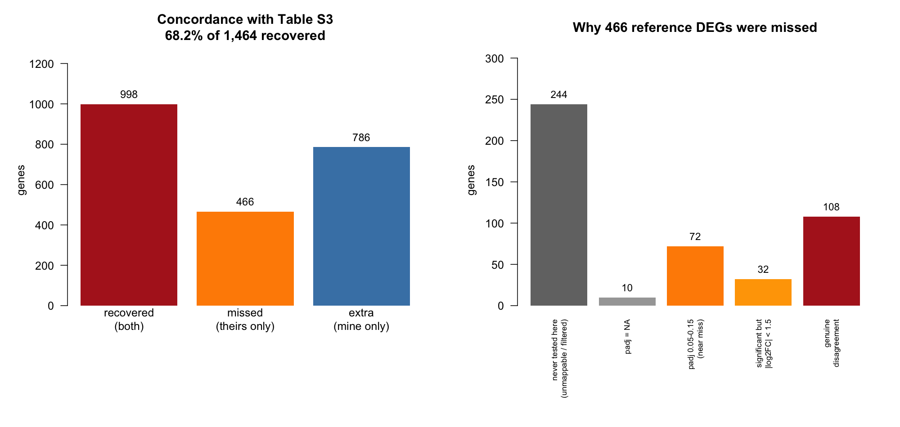
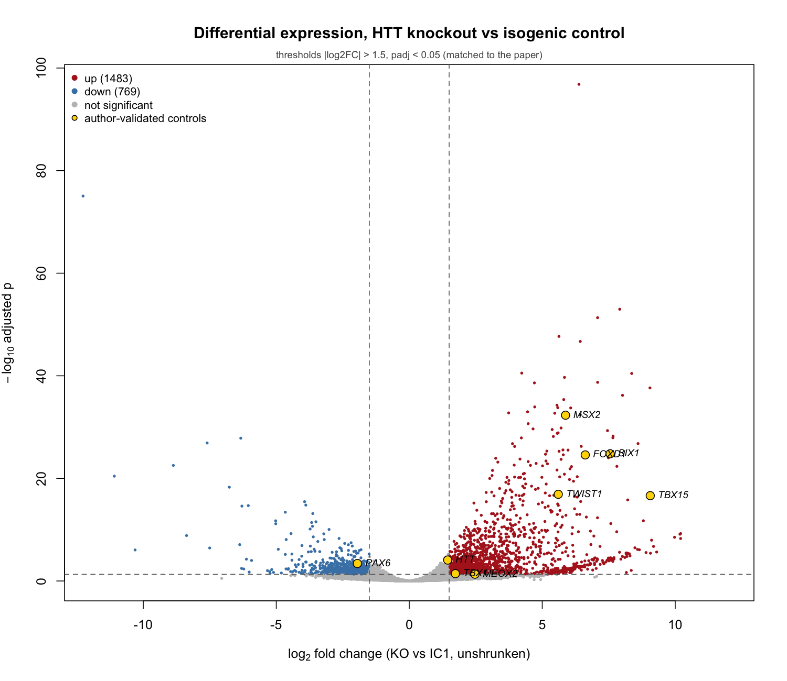

# Independent reanalysis of an HTT-knockout RNA-seq dataset

I reanalyzed GSE270472 (Kozłowska et al., *Cell & Bioscience* 2025) using a
different quantification pipeline than the original study, to see how much of a
published differential expression result holds up when the counts underneath it
are generated a different way.

I recovered 68.2% of the reported gene list. Most of this README is about where
the other 31.8% went.

---

## Main result

| | |
|---|---|
| Reference DEGs (recomputed from Supplementary Table 3) | 1,464 |
| DEGs I called at matched thresholds | 2,252 |
| Called by both | 998 |
| **Recovery rate** | **68.2%** of all reference DEGs, **81.8%** of the 1,220 I could test |
| Sign agreement among shared DEGs | 100.0% |
| Spearman ρ of log2FC (shared DEGs) | 0.896 |



466 reference DEGs did not come out significant in my analysis. 244 of those I
never tested at all, because they have no counterpart in my pipeline's gene
universe. Of the 222 I did test, 72 were near misses (padj between 0.05 and
0.15) and 32 were significant but fell below the fold-change cutoff. That leaves
about 108 genes, roughly 7% of the reference list, where the two analyses
actually disagree.

---

## Where the pipelines differ

The original study used RSEM against Ensembl v102. I started from NCBI's
precomputed count matrix, which uses a different aligner against RefSeq
GRCh38.p13. These are two separate annotation projects, not two versions of one,
so they disagree about gene boundaries and about which genes exist.

| | Original | This reanalysis |
|---|---|---|
| Quantification | RSEM v1.3.1, EM assignment of multi-mappers | NCBI count-based pipeline |
| Annotation | Ensembl v102 | NCBI RefSeq GRCh38.p13 |
| rRNA removal | bowtie2 depletion before quantification | none |
| Control replicates | 3 | 2 (GSM8343537 is missing from NCBI's matrix) |
| Independent filtering | disabled | DESeq2 default (on) |
| DESeq2 | v1.30.0 | Bioconductor 3.23 |

The missing replicate wasn't my choice. NCBI's pipeline excluded it, so my
design is 2 vs 4 instead of 3 vs 4.

I listed all eleven expected sources of disagreement in
[`METHODS_LOG.md`](METHODS_LOG.md) §5 before running the comparison.

---

## Checking that the analysis is sound



HTT comes out at **+1.44**, against **+1.34** in Supplementary Table 3. A
knockout showing more HTT transcript than its control looks wrong, and I
originally recorded the expected direction backwards because of it. The
explanation is in the paper: IC1's corrected allele is silenced, so the control
only expresses HTT from one allele, and the knockout is a frameshift edit that
still gets transcribed.

All eight RT-qPCR-validated control genes move in the published direction. GO
enrichment on the 998 shared DEGs returns 256 terms, led by skeletal system
development (p.adj 2.5e-27), extracellular matrix organization, embryonic
morphogenesis and pattern specification. That is the neural crest and mesoderm
program the paper describes, so the two analyses agree on the biology and not
just on gene IDs.

---

## Why I called more DEGs than the paper

I get 2,252 DEGs where the reference set has 1,464. I registered four
explanations in advance and tested all four. None of them worked.

| Hypothesis | Test | Result |
|---|---|---|
| Low-expression genes drive the difference | recovery by baseMean quartile | flat: 81.3 / 80.3 / 80.3 / 85.2 |
| The extra genes are a distinct class | gene-type composition, up vs down | identical: 34.2% vs 34.3% ncRNA+pseudogene |
| Independent filtering inflates my count | rerun with `independentFiltering = FALSE` | 2,252 → 2,226, closes 3.3% of the gap |
| The extras are real signal I had power to find | GO enrichment on the extras alone | 3 marginal terms, zero shared with the 256 from the recovered set |

My conclusion is that the disagreement comes from upstream of the statistics.
Nothing I can change at the `results()` stage improves agreement, and the
variant that changes my DEG count the most actually makes recovery worse. That
leaves the quantifier, the annotation source, and the rRNA depletion step, which
produce different counts from the same reads.

One thing did get confirmed while testing this. Turning off independent
filtering and Cook's cutoff dropped my count of `NA` adjusted p-values from
2,326 to exactly 0, matching Table S3. I had inferred that the authors disabled
these settings only from the fact that their table has no NAs, and this
confirmed it.

---

## The DEG count is not very stable

| Variant | DEGs | Recovery |
|---|---|---|
| baseline | 2,252 | 68.2% |
| independent filtering off | 2,226 | 68.0% |
| + continuous passage covariate | 2,315 | 67.3% |
| drop KO_4 | 2,826 | 62.6% |

The two analytical choices I made move the count by less than 3%. Dropping one
of six samples moves it by 25% (Jaccard overlap with the baseline list: 0.662).
KO_4 is the sample that separates from the others on PC2, and including it
inflates within-group dispersion enough to make every test conservative. All 574
genes I gain by dropping it are downregulated.

So at this sample size, which samples are included matters more than how I
analyze them. That gives a second possible explanation for the extra DEGs that
doesn't require any pipeline difference: my dataset differs from the authors' by
exactly one sample, and a design this sensitive could produce a gap this size
from that alone. I can't test it without the excluded replicate.

---

## Limitations

- **Only 2 control replicates.** Dispersion estimates lean heavily on the fitted
  trend, and the two controls I have are the most dissimilar pair in the dataset
  on PC2, so my only estimate of within-control variability comes from an
  unusually spread pair.
- **The control line isn't wild-type.** The authors report that IC1's corrected
  allele is silenced. They switched to IC2 for later experiments, but the
  RNA-seq comparison still uses IC1.
- **The upstream explanation is an argument, not a demonstration.** Confirming
  it would mean re-quantifying from FASTQ with RSEM against Ensembl v102, which
  was outside what I could do here.
- **My GO results aren't directly comparable** to the paper's PANTHER output,
  since the gene universe and the algorithm both differ.
- **1,464 vs 1,401.** Applying the paper's stated thresholds to its own
  supplementary table gives 1,464 DEGs, not the 1,401 reported in the text. I
  ruled out duplicate and unannotated genes as causes but couldn't explain the
  rest, so I used the table-derived number throughout.

---

## Running this

Needs R ≥ 4.4 with Bioconductor. Data files aren't tracked in the repo. See
[`METHODS_LOG.md`](METHODS_LOG.md) §3 for provenance and exact filenames.

```r
install.packages(c("readxl", "BiocManager"))
BiocManager::install(c("DESeq2", "apeglm", "clusterProfiler", "org.Hs.eg.db"))
```

Download into `data/raw/`:

- `GSE270472_raw_counts_GRCh38.p13_NCBI.tsv.gz` and
  `Human.GRCh38.p13.annot.tsv.gz`, from GEO GSE270472 under
  "Download RNA-seq counts"
- `13578_2025_1443_MOESM5_ESM.xlsx`, Supplementary Table 3 from the paper

Then run in order from the repo root:

```r
source("scripts/01_load_data.R")    # import, metadata, sanity checks
source("scripts/02_deseq2.R")       # differential expression
source("scripts/03_concordance.R")  # comparison against Table S3
source("scripts/04_enrichment.R")   # GO enrichment
source("scripts/05_sensitivity.R")  # three sensitivity analyses
source("scripts/06_figures.R")      # figures
```

Each script saves an `.rds` to `data/processed/` that the next one loads.

---

## Repo layout

```
scripts/     01-06, run in order
results/
  figures/   diagnostics (02), concordance (03), enrichment (04),
             sensitivity (05), writeup figures (06)
  tables/    full DE results, shared/missed/extra gene lists,
             GO terms, sensitivity summary
notes/       prep_python_to_r.R, the R conventions I used throughout
METHODS_LOG.md
```

[`METHODS_LOG.md`](METHODS_LOG.md) is my working record: decisions, parameters,
registered predictions and corrections, in the order they happened. It includes
the things I got wrong, like the HTT direction and the four failed hypotheses,
since that's what actually happened while doing the analysis.

---

## Source

Kozłowska et al. (2025). *Cell & Bioscience* 15:100.
[10.1186/s13578-025-01443-5](https://doi.org/10.1186/s13578-025-01443-5) ·
PMID 40635054 · Open access (CC BY) · Data: GEO
[GSE270472](https://www.ncbi.nlm.nih.gov/geo/query/acc.cgi?acc=GSE270472)

This is an independent reanalysis, not affiliated with the original authors.
